# `Hotel Management System With JavaFX`<br>


## Introduction:

```
-- MySQL Dump
-- Host: localhost | Database: HMS0
-- ------------------------------------------------------
-- Server Version: 8.0.25

-- Set up character sets and time zone settings
SET @OLD_CHARACTER_SET_CLIENT = @@CHARACTER_SET_CLIENT;
SET @OLD_CHARACTER_SET_RESULTS = @@CHARACTER_SET_RESULTS;
SET @OLD_COLLATION_CONNECTION = @@COLLATION_CONNECTION;
SET NAMES utf8mb4;
SET @OLD_TIME_ZONE = @@TIME_ZONE;
SET TIME_ZONE = '+00:00';
SET @OLD_UNIQUE_CHECKS = @@UNIQUE_CHECKS; 
SET UNIQUE_CHECKS = 0;
SET @OLD_FOREIGN_KEY_CHECKS = @@FOREIGN_KEY_CHECKS;
SET FOREIGN_KEY_CHECKS = 0;
SET @OLD_SQL_MODE = @@SQL_MODE;
SET SQL_MODE = 'NO_AUTO_VALUE_ON_ZERO';
SET @OLD_SQL_NOTES = @@SQL_NOTES;
SET SQL_NOTES = 0;

-- Table structure for `admininfo`
DROP TABLE IF EXISTS `admininfo`;
CREATE TABLE `admininfo` (
  `NID` VARCHAR(25) NOT NULL,
  `NAME` VARCHAR(30) DEFAULT NULL,
  `PASSWORD` VARCHAR(30) DEFAULT NULL,
  PRIMARY KEY (`NID`)
) ENGINE=InnoDB DEFAULT CHARSET=utf8mb4 COLLATE=utf8mb4_general_ci;

-- Insert data into `admininfo`
INSERT INTO `admininfo` VALUES 
('123','admin','admin'),
('admin','admin','admin'),
('root','admin','admin');

-- Table structure for `checkinoutinfo`
DROP TABLE IF EXISTS `checkinoutinfo`;
CREATE TABLE `checkinoutinfo` (
  `SI_NO` INT NOT NULL AUTO_INCREMENT,
  `NAME` VARCHAR(30) DEFAULT NULL,
  `EMAIL` VARCHAR(30) DEFAULT NULL,
  `PHONE` VARCHAR(30) DEFAULT NULL,
  `ADDRESS` VARCHAR(30) DEFAULT NULL,
  `NID` VARCHAR(15) DEFAULT NULL,
  `ROOMNO` VARCHAR(15) DEFAULT NULL,
  `ROOMTYPE` VARCHAR(15) DEFAULT NULL,
  `CAPACITY` VARCHAR(15) DEFAULT NULL,
  `CHECKEDIN` VARCHAR(20) DEFAULT NULL,
  `CHECKEDOUT` VARCHAR(20) DEFAULT NULL,
  `PRICEDAY` VARCHAR(30) DEFAULT NULL,
  `TOTALDAYS` VARCHAR(30) DEFAULT NULL,
  `TOTALPRICE` VARCHAR(30) DEFAULT NULL,
  PRIMARY KEY (`SI_NO`)
) ENGINE=InnoDB AUTO_INCREMENT=40 DEFAULT CHARSET=utf8mb4 COLLATE=utf8mb4_general_ci;

-- Insert data into `checkinoutinfo`
INSERT INTO `checkinoutinfo` VALUES 
(16,'3','3','3','3','3','12','12','12','2021-12-06','2021-12-06','12','1','12'),
(17,'2','2','2','2','2','9','9','9','2021-12-06','2021-12-06','9','1','9'),
(18,'4','4','4','4','4','11','Non-Ac','Double','2021-12-06','2021-12-16','500','11','5500'),
(19,'8','8','8','8','8','11','Non-Ac','Double','2021-12-06','2021-12-07','500','2','1000'),
(20,'3','3','3','3','3','11','Non-Ac','Double','2021-12-06','2021-12-06','500','1','500'),
(21,'2','3','2','2','2','13','Ac','12','2020-12-01','2020-12-31','12','31','372'),
(22,'2','3','2','2','2','13','Ac','12','2020-09-01','2020-11-30','12','91','1092'),
(23,'2','3','2','2','2','13','Ac','12','2013-07-01','2021-11-30','12','155','1860'),
(24,'23','3','2','2','2','13','Ac','12','2021-12-06','2021-12-19','12','22','4884'),
(25,'Md. Mursalin','mursa@gamil.com','015555','Dhaka, Bangladesh','mursalin','1','AC','Single','2021-12-01','2021-12-10','1500','10','15000'),
(26,'Md. Mursalin','mursa@gamil.com','015555','Dhaka, Bangladesh','mursalin','11','Non-Ac','Double','2021-12-02','2021-12-19','500','22','4884'),
(27,'mursalin','mursalin@gmail.com','mursalin','mursalin','mursalin','111','AC','Double','2021-11-30','2021-12-18','1000','19','19000'),
(28,'mursalin','mursalin@gmail.com','mursalin','mursalin','mursalin','2','AC-Room','Double','2021-11-28','2021-12-08','2000','11','22000'),
(29,'1','1','1','1','1','1','AC','Single','2021-11-29','2021-12-17','1500','19','28500'),
(30,'mursalin','mursalin@gmail.com','01222222','Dhaka, Bangladesh','mursalin','1','AC','Single','2021-12-17','2021-12-19','1500','22','4884'),
(31,'1','1','1111','1','1','111','AC','Double','2021-11-28','2021-12-19','1000','22','4884'),
(32,'4','4','4','4','4','12','12','12','2021-12-18','2021-12-19','12','22','4884'),
(33,'mursalin','mursalin@gmail.com','01222222','Dhaka, Bangladesh','mursalin','123','1222','222','2021-11-30','2021-12-25','222','26','5772'),
(34,'1','1','1111','1','1','123','1222','222','2021-11-28','2021-12-19','222','22','4884'),
(35,'mursalin','mursalin@gmail.com','01222222','Dhaka, Bangladesh','mursalin','1','AC','Single','2021-11-29',NULL,'1500',NULL,NULL),
(36,'mursalin','mursalin@gmail.com','01222222','Dhaka, Bangladesh','mursalin','11','Non-Ac','Double','2021-11-29',NULL,'500',NULL,NULL),
(37,'mursalin','mursalin@gmail.com','01222222','Dhaka, Bangladesh','mursalin','12','12','12','2021-11-29',NULL,'12',NULL,NULL),
(38,'mursalin','mursalin@gmail.com','01222222','Dhaka, Bangladesh','mursalin','111','AC','Double','2021-12-19',NULL,'1000',NULL,NULL),
(39,'1','1','1111','1','1','123','1222','222','2021-12-19',NULL,'222',NULL,NULL);

-- Table structure for `customerinfo`
DROP TABLE IF EXISTS `customerinfo`;
CREATE TABLE `customerinfo` (
  `NAME` VARCHAR(30) DEFAULT NULL,
  `NID` VARCHAR(30) NOT NULL,
  `PASSWORD` VARCHAR(30) DEFAULT NULL,
  `EMAIL` VARCHAR(30) DEFAULT NULL,
  `PHONE` VARCHAR(30) DEFAULT NULL,
  `ADDRESS` VARCHAR(40) DEFAULT NULL,
  PRIMARY KEY (`NID`)
) ENGINE=InnoDB DEFAULT CHARSET=utf8mb4 COLLATE=utf8mb4_general_ci;

-- Insert data into `customerinfo`
INSERT INTO `customerinfo` VALUES 
('123','1','1','1','1111','1'),
('4','4','4','4','4','4'),
('a','a','a','a','a','a'),
('mursalin','mursalin','mursalin','mursalin@gmail.com','01222222','Dhaka, Bangladesh');

-- Table structure for `employeeinfo`
DROP TABLE IF EXISTS `employeeinfo`;
CREATE TABLE `employeeinfo` (
  `NAME` VARCHAR(30) DEFAULT NULL,
  `NID` VARCHAR(30) NOT NULL,
  `PASSWORD` VARCHAR(30) DEFAULT NULL,
  `EMAIL` VARCHAR(30) DEFAULT NULL,
  `ADDRESS` VARCHAR(40) DEFAULT NULL,
  `PHONE` VARCHAR(30) DEFAULT NULL,
  PRIMARY KEY (`NID`)
) ENGINE=InnoDB DEFAULT CHARSET=utf8mb4 COLLATE=utf8mb4_general_ci;

-- Insert data into `employeeinfo`
INSERT INTO `employeeinfo` VALUES 
('123','1','1','1','1','1'),
('2','2','2','2','2','2'),
('3','3','3','3','3','3'),
('4','4','4','4','4','4'),
('mursalin','mursalin','mursalin','mursalin@gmail.com','Dhaka, Bangladesh','01222222');

-- Table structure for `roominfo`
DROP TABLE IF EXISTS `roominfo`;
CREATE TABLE `roominfo` (
  `ROOMNO` VARCHAR(30) NOT NULL,
  `ROOMTYPE` VARCHAR(30) DEFAULT NULL,
  `CAPACITY` VARCHAR(30) DEFAULT NULL,
  `PRICEDAY` VARCHAR(30) DEFAULT NULL,
  PRIMARY KEY (`ROOMNO`)
) ENGINE=InnoDB DEFAULT CHARSET=utf8mb4 COLLATE=utf8mb4_general_ci;

-- Insert data into `roominfo`
INSERT INTO `roominfo` VALUES 
('1','AC','Single','1500'),
('11','Non-Ac','Double','500'),
('12','Non-Ac','Double','500'),
('13','Ac','12','12'),
('123','1222','222','222');

-- Reset the settings to their original values
SET TIME_ZONE = @OLD_TIME_ZONE;
SET SQL_MODE = @OLD_SQL_MODE;
SET FOREIGN_KEY_CHECKS = @OLD_FOREIGN_KEY_CHECKS;
SET UNIQUE_CHECKS = @OLD_UNIQUE_CHECKS;
SET CHARACTER_SET_CLIENT = @OLD_CHARACTER_SET_CLIENT;
SET CHARACTER_SET_RESULTS = @OLD_CHARACTER_SET_RESULTS;
SET COLLATION_CONNECTION = @OLD_COLLATION_CONNECTION;
SET SQL_NOTES = @OLD_SQL_NOTES;

```
Hotel management System is a desktop application where users
can book hotel room, review about the hotel service. Managers
can manage rooms, book rooms for new customers. And the admin of this application can create,
update and delete employees for their application and can also
see the total earnings from their hotel.

In this way, the hotel management will be easier to handle
with this application than they used to keep track of all details
manually in their ledger. The customers, managers and the
employees can be more happy with this new system.

## Watch Overview Video

[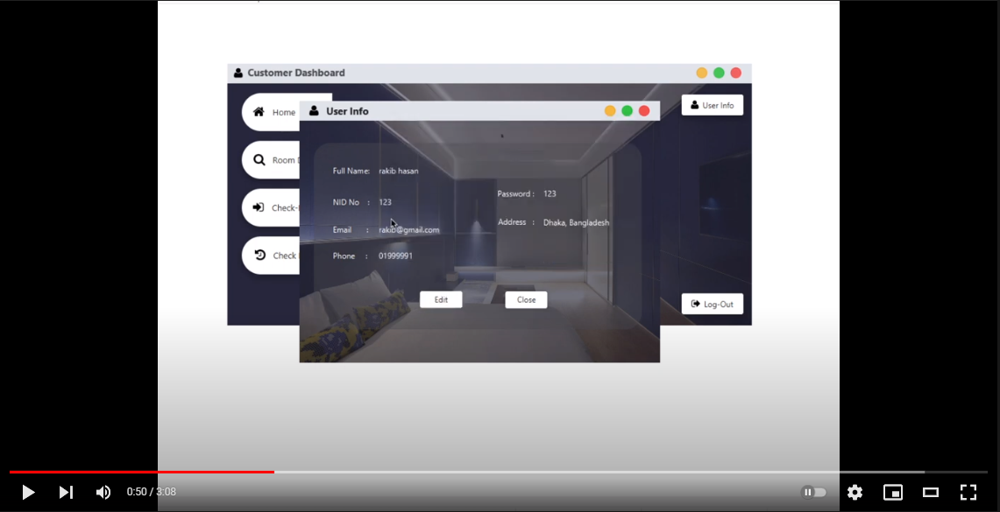](https://www.youtube.com/watch?v=_UOMsHpJSeg)

## Screenshots:
<div align = center>

## `Home Window`

Main Window <br>

## `Customer`

Customer Login <br>
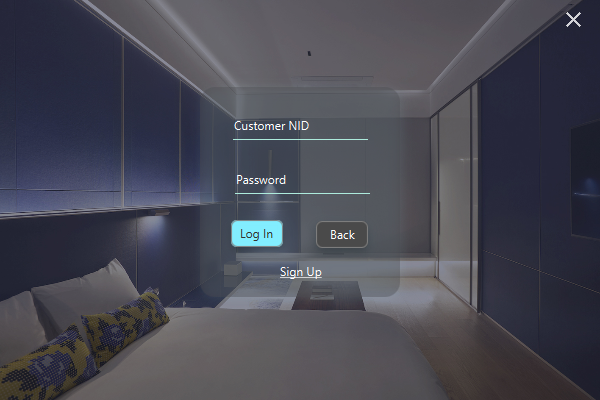 <br>
Customer Sign-Up<br>
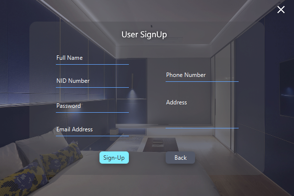 <br>
Customer UserInfo<br>
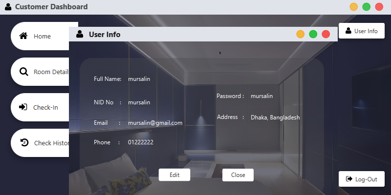 <br>

[comment]: <> (Customer UserInfo Edit<br>)
[comment]: <> (![UserInfo Edit]&#40;screenshots/Customer0000.PNG "UserInfo Edit"&#41; <br>)
Customer Home<br>
 <br>
Customer Manage Room<br>
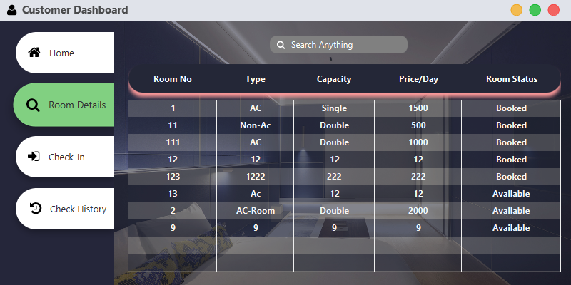 <br>
Customer Check In<br>
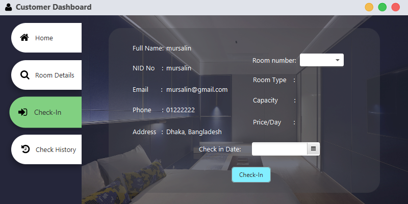 <br>
Customer Check History<br>
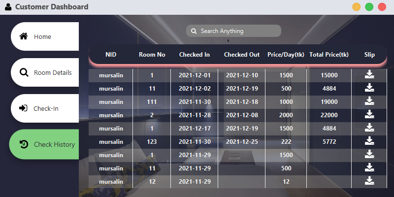 <br>

## `Manager`

[comment]: <> (Manager Home <br>)
[comment]: <> (![Manager Home]&#40;screenshots/Manager0.PNG "Manager Home"&#41; <br>)
Manager Manage Room <br>
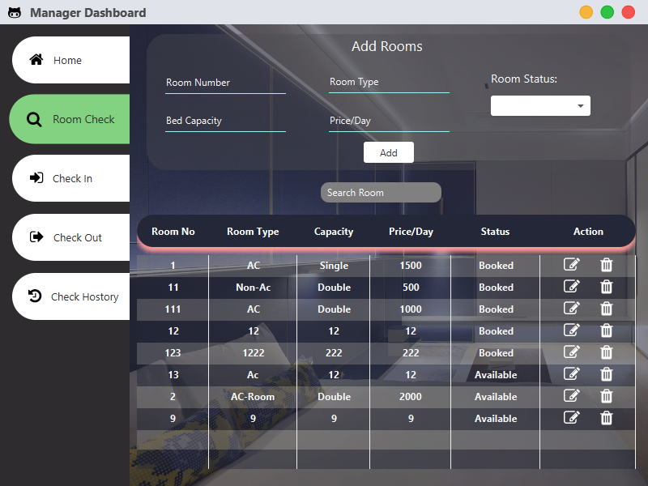 <br>

[comment]: <> (Manager Check In <br>)

[comment]: <> (![Check In]&#40;screenshots/Manager2.PNG "Manager Check In"&#41; <br>)
Manager Check Out <br>
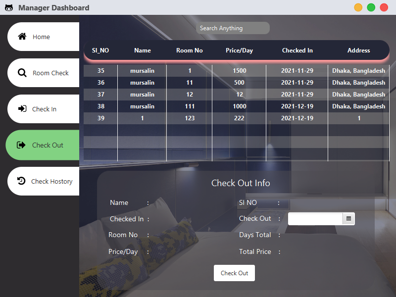 <br>

[comment]: <> (Manager Check History <br>)

[comment]: <> (![Check History]&#40;screenshots/Manager4.PNG "Manager Check History"&#41; <br>)

## `Admin`

[comment]: <> (Admin Home <br>)

[comment]: <> (![Admin Home]&#40;screenshots/Admin0.PNG "Admin Home"&#41; <br>)
Admin Add Employee <br>
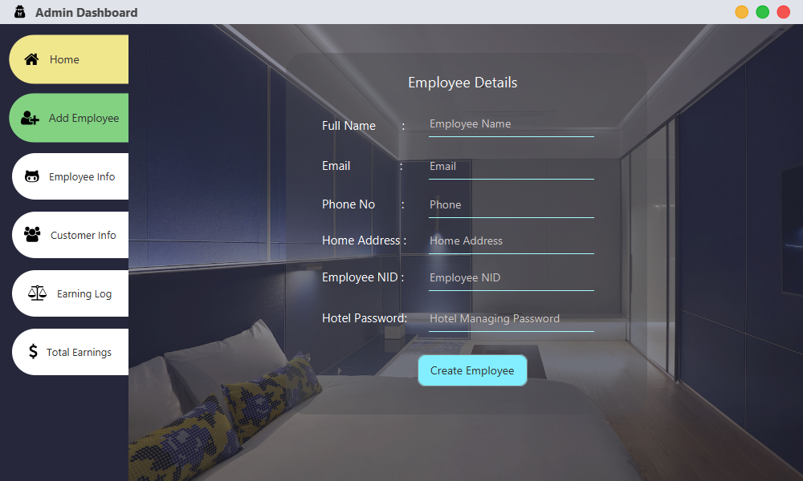 <br>
Admin Employee Info <br>
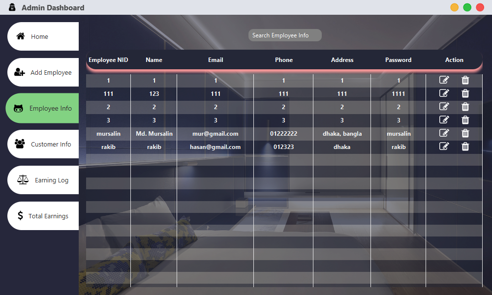 <br>

[comment]: <> (Admin Customer Info <br>)

[comment]: <> (![Admin Customer Info]&#40;screenshots/Admin3.PNG "Admin Customer Info"&#41; <br>)
Admin Earning Log <br>
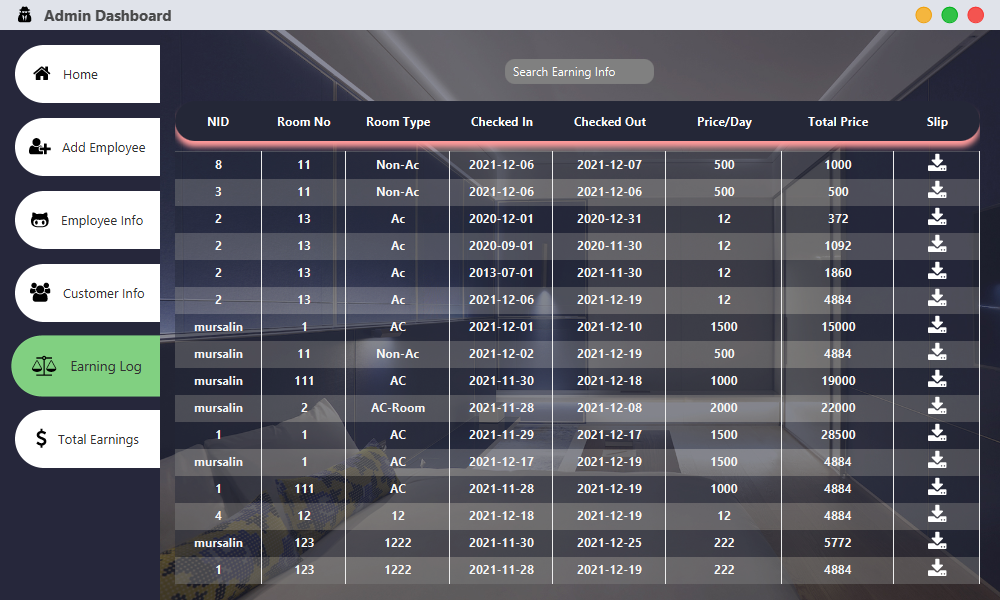 <br>

  </div>

## All Download Links:

Jar Download Link: <a href = "https://github.com/Rakib-Hasan-455/Hotel_Management_System-JavaFx/raw/master/Hotel_Management_System%20JavaFx.jar"> Download </a><br>
Exe File Download Link: <a href = "https://github.com/Rakib-Hasan-455/Hotel_Management_System-JavaFx/raw/master/Hotel_Management_System.exe"> Download </a><br>
Hotel Management System Database Download Link:  <a href = "https://downgit.github.io/#/home?url=https://github.com/Rakib-Hasan-455/Hotel_Management_System-JavaFx/blob/master/Hotel_Management_System.sql"> Download </a><br>
Java Version 8 Download Link: <a href = "https://www.oracle.com/java/technologies/javase/javase8u211-later-archive-downloads.html"> Download </a><br>
<br>

## Used Library Files:

JFoenix 8.0.10: <a href = "https://github.com/Rakib-Hasan-455/Hotel_Management_System-JavaFx/raw/master/lib/jfoenix-8.0.10.jar"> Download </a><br>
MySql JDBC Connector 8.0.26:  <a href = "https://github.com/Rakib-Hasan-455/Hotel_Management_System-JavaFx/raw/master/lib/mysql-connector-java-8.0.26.jar"> Download </a><br>
FontAwesomeFX 8.9:  <a href = "https://github.com/Rakib-Hasan-455/Hotel_Management_System-JavaFx/raw/master/lib/fontawesomefx-8.9.jar"> Download </a><br>
itextpdf-5.3.4:  <a href = "https://github.com/Rakib-Hasan-455/Hotel_Management_System-JavaFx/raw/master/lib/itextpdf-5.3.4.jar"> Download </a><br>


## Requirements to Run this project/Jar/Exe file:
<li>Install MySql and it should be running on <b>localhost:3306</b>  .</li>
<li><a href = "https://downgit.github.io/#/home?url=https://github.com/Rakib-Hasan-455/Hotel_Management_System-JavaFx/blob/master/Hotel_Management_System.sql"> Download </a> 
 Hotel Management System Database and Install it into your MySql Database.</li>
<li> Your Java Version Must be 8 or above.</li>
<li> Make Sure to edit 'sample/_backend/DBConnection.java' class. Where you need to edit database name, your database username and password which should be according to your own MySql database setup.</li>

## Default UserNid and Password

`Customer:`<br>
UserNid     : 4 <br>
userPassword: 4 <br>

`Manager` <br>
UserNid     : 2 <br>
userPassword: 2 <br>

`admin` <br>
UserNid     : admin <br>
userPassword: admin <br>


## Things and Tools I Used in this project:
<li> IntellIJ IDE </li>
<li> SceneBuilder 8.5 (for JFoenix 8.0.10 & java 8 compatible) </li>
<li> Java 8 </li>
<li> JavaFX </li>
<li> MySql </li>
<li> MySql JDBC Connector </li>
<li> JFoenix UI Components 8.0.10 </li>
<li> FontAwesome Font Components </li>

## Contributing
Pull requests are welcome. For major changes, please open an issue first to discuss what you would like to change.
Please make sure to update tests as appropriate.

## License
Distributed under the MIT License. See [License](LICENSE) for more information.
